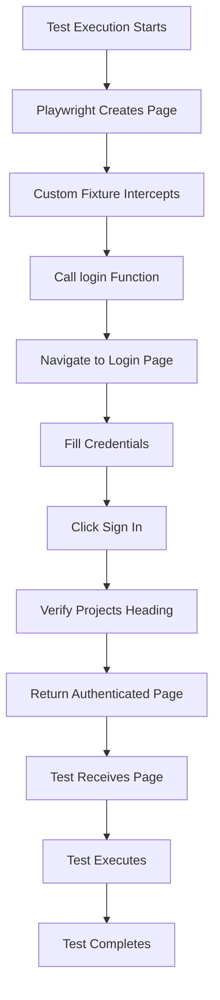

# Architecture Reference: Playwright Test Automation

This document describes the architecture and design patterns used in this Playwright test automation project. It serves as a reference for understanding the codebase structure and making modifications.

## Core Architecture Pattern: Fixture-Based Auto-Login

The project uses **Playwright's fixture extension system** to automatically authenticate before each test, eliminating repetitive login code and ensuring test isolation.

### File Structure

```
tests/
├── fixtures.ts          # Custom test fixtures with auto-login
├── utils/
│   └── auth.ts          # Login helper function
└── example.spec.ts       # Test cases
```

### Key Files and Their Roles

#### `tests/fixtures.ts` (Lines 1-12)

**Purpose**: Extends Playwright's base test with a custom `page` fixture that automatically logs in before each test.

**Code Pattern**:
```typescript
export const test = base.extend({
  page: async ({ page }, use) => {
    await login(page);  // Executes before test
    await use(page);    // Test runs here
  },
});
```

**Execution Flow**:
1. Playwright creates a new `page` instance
2. Custom fixture intercepts and calls `login(page)`
3. Login completes, page is authenticated
4. Test receives authenticated `page` via `use(page)`
5. Test executes with authenticated state

**Why This Pattern**:
- **Encapsulation**: Setup and teardown in one place
- **Reusability**: All tests using `test` from fixtures.ts get auto-login
- **On-demand**: Only runs when tests need the `page` fixture
- **Isolation**: Each test gets a fresh authenticated page

#### `tests/utils/auth.ts` (Lines 1-10)

**Purpose**: Centralized login function that performs authentication.

**Function Signature**:
```typescript
export async function login(page: Page): Promise<void>
```

**Execution Steps**:
1. Navigate to login page
2. Fill username field
3. Fill password field
4. Click sign in button
5. Wait for Projects heading (verifies successful login)

**Credentials**:
- URL: `https://animated-gingersnap-8cf7f2.netlify.app/`
- Username: `admin`
- Password: `password123`

**Why Centralized**:
- Single source of truth for authentication logic
- Easy to update credentials or flow
- Reusable across test files

## Execution Flow Diagram



## File Dependencies

```mermaid
graph LR
    A[example.spec.ts] -->|imports| B[fixtures.ts]
    B -->|imports| C[auth.ts]
    A -->|uses| D[@playwright/test]
    B -->|extends| D
    C -->|uses| D
```

**Dependency Chain**:
1. `example.spec.ts` imports `test` and `expect` from `fixtures.ts`
2. `fixtures.ts` imports `login` from `utils/auth.ts`
3. `fixtures.ts` extends base `test` from `@playwright/test`
4. All files use Playwright types and utilities

## Design Patterns

### 1. Fixture Extension Pattern

**Location**: `tests/fixtures.ts`

**Pattern**: Extend Playwright's base test to add custom behavior to the `page` fixture.

**Benefits**:
- Automatic: No need to remember to call login
- Consistent: All tests start from same authenticated state
- Maintainable: Update login logic in one place

**Alternative Approaches Considered**:
- `beforeEach` hooks: Less reusable, harder to compose
- Manual login in each test: Repetitive, error-prone
- Global setup: Less flexible, harder to debug

### 2. Helper Function Pattern

**Location**: `tests/utils/auth.ts`

**Pattern**: Extract reusable logic into pure functions.

**Benefits**:
- Testable: Can be tested independently
- Reusable: Can be used in fixtures, hooks, or tests
- Maintainable: Single place to update logic

### 3. Semantic Selector Strategy

**Pattern**: Use `getByRole`, `getByLabel`, `getByText` instead of CSS selectors.

**Why**:
- More resilient to UI changes
- Better accessibility alignment
- Clearer intent in test code

## Extension Points

### Adding New Tests

1. Import `test` and `expect` from `fixtures.ts`:
   ```typescript
   import { test, expect } from './fixtures';
   ```

2. Write test - authentication is automatic:
   ```typescript
   test('my test', async ({ page }) => {
     // page is already authenticated
   });
   ```

### Modifying Login Flow

1. Edit `tests/utils/auth.ts`
2. Update the `login` function
3. All tests automatically use new login flow

### Adding New Fixtures

1. Extend `tests/fixtures.ts`:
   ```typescript
   export const test = base.extend({
     page: async ({ page }, use) => {
       await login(page);
       await use(page);
     },
     // Add new fixture here
     myFixture: async ({ page }, use) => {
       // Setup
       await use(myValue);
       // Teardown
     },
   });
   ```

### Using Base Test (Without Auto-Login)

For tests that need to test login itself:

```typescript
import { test as baseTest } from '@playwright/test';

baseTest('login test', async ({ page }) => {
  // No auto-login, test login flow
});
```

## Configuration

### Playwright Config (`playwright.config.ts`)

**Key Settings**:
- `trace: 'retain-on-failure'`: Captures comprehensive traces only on failure
- `reporter: 'line'`: Clean console output
- `retries: process.env.CI ? 2 : 0`: Retry on CI only
- `workers: process.env.CI ? 1 : undefined`: Sequential on CI, parallel locally

**Projects**: Three browser projects (chromium, firefox, webkit) for cross-browser testing.

## Test Isolation

Each test is completely isolated:
- Fresh page instance per test
- Fresh authentication per test
- No shared state between tests
- Can run in parallel safely

## Debugging

### When Login Fails

1. Check trace files in `test-results/` directory
2. Traces include:
   - DOM snapshots at each step
   - Network requests/responses
   - Console logs
   - Screenshots
3. View trace: `npx playwright show-trace <trace-file>`

### Common Issues

- **Login timeout**: Check network connectivity, verify credentials
- **Element not found**: Check if selectors match current UI
- **Fixture not working**: Ensure importing `test` from `fixtures.ts`, not `@playwright/test`

## Best Practices Followed

1. ✅ **DRY**: Login logic centralized
2. ✅ **Isolation**: Each test independent
3. ✅ **Semantic Selectors**: Using getByRole, getByLabel
4. ✅ **Trace Collection**: Comprehensive debugging on failure
5. ✅ **Type Safety**: Using TypeScript throughout
6. ✅ **Maintainability**: Clear separation of concerns
