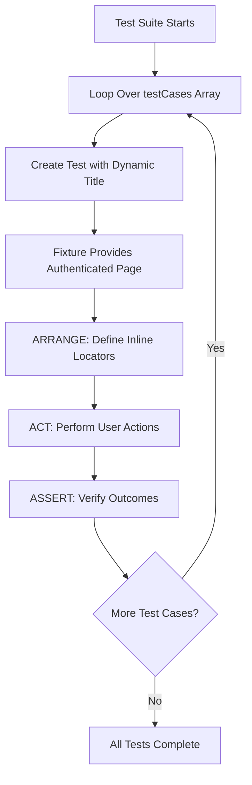

# Architecture v2: Data-Driven Testing Strategy

This document describes the data-driven testing approach implemented in this Playwright test automation project. This strategy significantly reduces code duplication and makes it easier to add new test cases while keeping test logic inline and self-contained.

## Overview

The test suite uses a **data-driven testing pattern** where test logic is separated from test data. Instead of writing individual test functions for each scenario, we define test cases as data structures and use a single test function that iterates over them. Tests follow the **ARRANGE-ACT-ASSERT** pattern with inline locator definitions.

## Architecture Pattern: Data-Driven Tests with Inline Logic

### File Structure

```
tests/
├── fixtures.ts          # Custom test fixtures with auto-login
├── utils/
│   └── auth.ts          # Login helper function
└── projectTasks.spec.ts # Data-driven test cases
```

**Note**: Helper functions are NOT used. All test logic is inline within test files for simplicity and clarity.

### Key Components

#### 1. Test Data Array (`tests/projectTasks.spec.ts` lines 3-40)

All test cases are defined as a single array of objects:

```typescript
const testCases = [
  {
    project: 'Web Application',
    taskName: 'Implement user authentication',
    column: 'To Do',
    tags: ['Feature', 'High Priority'],
  },
  // ... more test cases
] as const;
```

**Data Structure:**
- `project`: The project name to navigate to
- `taskName`: The name of the task to verify
- `column`: The column name where the task should be located (To Do, In Progress, Done)
- `tags`: Array of tags that should be present on the task

**Why `as const`:**
- Makes the array readonly for type safety
- Ensures TypeScript infers literal types
- Prevents accidental mutations

#### 2. ARRANGE-ACT-ASSERT Pattern (`tests/projectTasks.spec.ts` lines 42-65)

Tests follow a clear three-phase structure with inline locator definitions:

**ARRANGE**: Define all locators upfront at the top of the test
```typescript
const projectNameButton = page.getByRole('button', { name: testCase.project, exact: true });
const projectNameHeading = page.getByRole('banner').getByRole('heading', { name: testCase.project, exact: true });
const columnHeading = page.getByRole('heading', { name: testCase.column, exact: true });
const column = columnHeading.locator('..');
const taskCardHeading = column.getByRole('heading', { name: testCase.taskName });
const taskCard = taskCardHeading.locator('..');
```

**ACT**: Perform user actions
```typescript
await projectNameButton.click();
```

**ASSERT**: Verify expected outcomes
```typescript
await expect(projectNameHeading).toBeVisible();
await expect(taskCardHeading).toBeVisible();

for (const tagName of testCase.tags) {
  const tag = taskCard.getByText(tagName, { exact: true });
  await expect(tag).toBeVisible();
}
```

**Benefits of Inline Locators:**
- **Simplicity**: Easier to understand test flow without jumping between files
- **Clarity**: Locators are defined where they're used, making tests self-contained
- **Flexibility**: Each test can define locators exactly as needed
- **Maintainability**: Changes to locators are localized to the test file

#### 3. Test Execution Loop (`tests/projectTasks.spec.ts` lines 42-65)

Single loop that generates test cases dynamically:

```typescript
for (const testCase of testCases) {
  test(`Test Case: Verify ${testCase.taskName} in ${testCase.project} project`, async ({ page }) => {
    // ARRANGE - Define locators
    // ACT - Perform actions
    // ASSERT - Verify outcomes
  });
}
```

**Execution Flow:**
1. Loop iterates over `testCases` array
2. For each test case, creates a test with dynamic title
3. Test receives authenticated `page` from fixture
4. Test defines locators inline in ARRANGE section
5. Test performs actions in ACT section
6. Test verifies outcomes in ASSERT section
7. Each test runs independently and in parallel

## Execution Flow Diagram



## Benefits of Data-Driven Approach

### 1. Code Reduction
- **Before**: ~94 lines with 6 separate test functions
- **After**: ~66 lines with single test logic
- **Maintenance**: Changes to test logic happen in one place

### 2. Easy to Extend
Adding a new test case requires only adding a data entry:

```typescript
{
  project: 'Marketing Campaign',
  taskName: 'New task name',
  column: 'To Do',
  tags: ['Feature'],
}
```

No need to duplicate test logic.

### 3. Clear Separation of Concerns
- **Test Data**: What to test (in `testCases` array)
- **Test Logic**: How to test (inline in test body with ARRANGE-ACT-ASSERT)
- **Test Infrastructure**: Setup/teardown (in fixtures)

### 4. Type Safety
TypeScript ensures:
- All required fields are present in test data
- Compile-time validation of test structure
- Type inference from `as const`

### 5. Maintainability
- Update selector logic in one place (test body)
- Change test flow in one place (test body)
- Add/remove test cases by modifying array
- Locators defined inline make changes obvious

### 6. Readability
- ARRANGE-ACT-ASSERT pattern provides clear structure
- Inline locators show exactly what elements are being tested
- No need to jump between files to understand test flow

## Design Patterns Used

### 1. Data-Driven Testing Pattern

**Pattern**: Separate test data from test logic, iterate over data to generate tests.

**Implementation**: Array of test case objects + loop that creates tests.

**Benefits**: Reduces duplication, easier to maintain, scalable.

### 2. ARRANGE-ACT-ASSERT Pattern

**Pattern**: Structure tests in three phases: setup (ARRANGE), action (ACT), verification (ASSERT).

**Implementation**: 
- ARRANGE: Define all locators at the top
- ACT: Perform user interactions
- ASSERT: Verify expected outcomes

**Benefits**: Clear structure, easy to understand, consistent pattern.

### 3. Inline Locator Definitions

**Pattern**: Define locators directly in the test where they're used, rather than in helper functions.

**Implementation**: All locators defined in ARRANGE section using semantic selectors.

**Benefits**: 
- Self-contained tests
- No abstraction overhead
- Easy to see what elements are being tested
- Flexible per-test customization

### 4. Semantic Selector Strategy

**Pattern**: Use `getByRole`, `getByLabel`, `getByText` instead of CSS selectors.

**Implementation**: All selectors use Playwright's semantic locators with `exact: true` when needed.

**Benefits**: More resilient to UI changes, better accessibility alignment.

## File Dependencies

```mermaid
graph LR
    A[projectTasks.spec.ts] -->|imports| B[fixtures.ts]
    B -->|imports| C[auth.ts]
    A -->|uses| D[@playwright/test types]
    B -->|extends| D
    C -->|uses| D
```

**Dependency Chain:**
1. `projectTasks.spec.ts` imports `test` and `expect` from `fixtures.ts`
2. `fixtures.ts` imports `login` from `utils/auth.ts`
3. All files use Playwright types and utilities
4. No helper function dependencies - all logic is inline

## Extension Points

### Adding New Test Cases

Simply add a new object to the `testCases` array:

```typescript
const testCases = [
  // ... existing test cases
  {
    project: 'New Project',
    taskName: 'New Task',
    column: 'In Progress',
    tags: ['Bug', 'High Priority'],
  },
];
```

The test will be automatically generated and executed.

### Modifying Test Logic

Update the test body in the loop:

```typescript
for (const testCase of testCases) {
  test(`Test Case: Verify ${testCase.taskName}...`, async ({ page }) => {
    // ARRANGE - Update locator definitions here
    const newLocator = page.getByRole('button', { name: testCase.newField });
    
    // ACT - Update actions here
    await newLocator.click();
    
    // ASSERT - Update assertions here
    await expect(newLocator).toBeVisible();
  });
}
```

### Supporting New Test Data Fields

1. Add field to test case objects:
   ```typescript
   {
     project: '...',
     taskName: '...',
     column: '...',
     tags: [...],
     newField: 'value',  // New field
   }
   ```

2. Use in test logic (ARRANGE section):
   ```typescript
   const newElement = page.getByRole('button', { name: testCase.newField });
   ```

## Comparison: Before vs After

### Before (Individual Test Functions)

```typescript
test('Test Case 1: ...', async ({ page }) => {
  await page.getByRole('button', { name: /^Web Application/ }).click();
  await expect(page.getByRole('banner')...).toBeVisible();
  const toDoSection = page.getByRole('heading', { name: /^To Do/ })...;
  await expect(toDoSection.getByRole('heading', { name: 'Task 1' })).toBeVisible();
  const taskCard = toDoSection.getByRole('heading', { name: 'Task 1' })...;
  await expect(taskCard.getByText('Feature', { exact: true })).toBeVisible();
  await expect(taskCard.getByText('High Priority', { exact: true })).toBeVisible();
});

test('Test Case 2: ...', async ({ page }) => {
  // Same pattern repeated...
});
```

**Issues:**
- Code duplication
- Hard to maintain
- Easy to miss updates
- Verbose
- No clear structure

### After (Data-Driven with Inline Logic)

```typescript
const testCases = [
  { project: 'Web Application', taskName: 'Task 1', column: 'To Do', tags: ['Feature', 'High Priority'] },
  { project: 'Web Application', taskName: 'Task 2', column: 'To Do', tags: ['Bug'] },
] as const;

for (const testCase of testCases) {
  test(`Test Case: Verify ${testCase.taskName}...`, async ({ page }) => {
    // ARRANGE - Define locators
    const projectNameButton = page.getByRole('button', { name: testCase.project, exact: true });
    const projectNameHeading = page.getByRole('banner').getByRole('heading', { name: testCase.project });
    const columnHeading = page.getByRole('heading', { name: testCase.column, exact: true });
    const column = columnHeading.locator('..');
    const taskCardHeading = column.getByRole('heading', { name: testCase.taskName });
    const taskCard = taskCardHeading.locator('..');

    // ACT - Perform actions
    await projectNameButton.click();

    // ASSERT - Verify outcomes
    await expect(projectNameHeading).toBeVisible();
    await expect(taskCardHeading).toBeVisible();

    for (const tagName of testCase.tags) {
      const tag = taskCard.getByText(tagName, { exact: true });
      await expect(tag).toBeVisible();
    }
  });
}
```

**Benefits:**
- Single test logic
- Easy to add cases
- Clear ARRANGE-ACT-ASSERT structure
- Inline locators show exactly what's being tested
- Maintainable

## Best Practices Followed

1. ✅ **DRY**: No code duplication
2. ✅ **Separation of Concerns**: Data vs logic vs infrastructure
3. ✅ **Type Safety**: TypeScript ensures correctness
4. ✅ **Semantic Selectors**: Using getByRole, getByLabel, getByText
5. ✅ **ARRANGE-ACT-ASSERT**: Clear test structure
6. ✅ **Inline Locators**: Self-contained, easy to understand
7. ✅ **Readability**: Clear test data structure and test flow
8. ✅ **Maintainability**: Single place to update logic

## When to Use Data-Driven Testing

**Good for:**
- Multiple test cases with same structure
- Testing same functionality with different data
- Scenarios where only input data changes
- Large test suites with repetitive patterns

**Not ideal for:**
- Tests with completely different flows
- One-off test scenarios
- Tests requiring custom setup/teardown per case
- Complex test logic that varies significantly

## Key Design Decisions

### Why Inline Locators Instead of Helpers?

**Decision**: Keep all locator definitions inline within tests.

**Rationale**:
- **Simplicity**: Easier to understand test flow without jumping between files
- **Clarity**: Locators are defined where they're used, making tests self-contained
- **Flexibility**: Each test can define locators exactly as needed
- **Maintainability**: Changes to locators are localized to the test file
- **Reduced Abstraction**: Less cognitive overhead, more direct

**Trade-offs**:
- Some locator definitions may be repeated across tests
- But the clarity and simplicity benefits outweigh the minor duplication

### Why ARRANGE-ACT-ASSERT?

**Decision**: Structure all tests using ARRANGE-ACT-ASSERT pattern.

**Rationale**:
- **Readability**: Clear separation of setup, action, and verification
- **Structure**: Consistent pattern makes tests easier to understand
- **Debugging**: Easy to identify which phase failed
- **Maintainability**: Changes are localized to the appropriate phase

### Why Data-Driven?

**Decision**: Use data-driven approach for similar test cases.

**Rationale**:
- **DRY**: No code duplication
- **Scalability**: Easy to add new test cases
- **Maintainability**: Update test logic in one place
- **Type Safety**: TypeScript ensures test data correctness

## Migration from v1 to v2

The data-driven approach was introduced to reduce code duplication. The migration:

1. **Identified Pattern**: All 6 tests followed same structure
2. **Extracted Data**: Created `testCases` array
3. **Refactored Tests**: Replaced 6 functions with 1 loop
4. **Applied ARRANGE-ACT-ASSERT**: Structured tests clearly
5. **Kept Logic Inline**: No helper functions for simplicity
6. **Maintained Behavior**: Same test coverage, cleaner code

## Locator Definition Guidelines

When defining locators inline:

1. **Define in ARRANGE section**: All locators at the top of the test
2. **Use descriptive names**: `projectNameButton`, `taskCardHeading`, `columnSection`
3. **Chain when needed**: Use `.locator('..')` to navigate DOM hierarchy
4. **Use semantic selectors**: `getByRole`, `getByLabel`, `getByText`
5. **Use `exact: true`**: When text matching needs to be precise
6. **Build from general to specific**: `page` → `section` → `element`

```typescript
// ✅ GOOD - Clear, descriptive, semantic
const projectNameButton = page.getByRole('button', { name: testCase.project, exact: true });
const projectNameHeading = page.getByRole('banner').getByRole('heading', { name: testCase.project });
const columnHeading = page.getByRole('heading', { name: testCase.column, exact: true });
const column = columnHeading.locator('..');
const taskCardHeading = column.getByRole('heading', { name: testCase.taskName });
const taskCard = taskCardHeading.locator('..');
```
