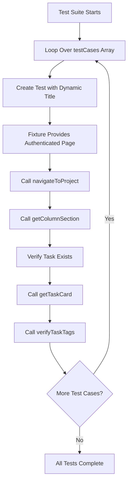

# Architecture v2: Data-Driven Testing Strategy

This document describes the data-driven testing approach implemented in this Playwright test automation project. This strategy significantly reduces code duplication and makes it easier to add new test cases.

## Overview

The test suite uses a **data-driven testing pattern** where test logic is separated from test data. Instead of writing individual test functions for each scenario, we define test cases as data structures and use a single test function that iterates over them.

## Architecture Pattern: Data-Driven Tests

### File Structure

```
tests/
├── fixtures.ts          # Custom test fixtures with auto-login
├── utils/
│   └── auth.ts          # Login helper function
└── example.spec.ts       # Data-driven test cases
```

### Key Components

#### 1. Test Data Array (`tests/example.spec.ts` lines 27-65)

All test cases are defined as a single array of objects:

```typescript
const testCases = [
  {
    project: 'Web Application',
    taskName: 'Implement user authentication',
    column: 'To Do',
    tags: ['Feature', 'High Priority'],
  },
  // ... more test cases
] as const;
```

**Data Structure:**
- `project`: The project name to navigate to
- `taskName`: The name of the task to verify
- `column`: The column name where the task should be located (To Do, In Progress, Done)
- `tags`: Array of tags that should be present on the task

**Why `as const`:**
- Makes the array readonly for type safety
- Ensures TypeScript infers literal types
- Prevents accidental mutations

#### 2. Helper Functions (`tests/example.spec.ts` lines 4-25)

Reusable functions that encapsulate common operations:

**`navigateToProject(page, projectName)`**
- Navigates to a specific project
- Verifies the project page loaded correctly
- Uses semantic selectors for reliability

**`getColumnSection(page, columnName)`**
- Returns a locator for the specified column section
- Uses regex pattern matching for flexible column name matching

**`getTaskCard(section, taskName)`**
- Returns a locator for the task card containing the specified task
- Assumes task heading exists (verification done separately)

**`verifyTaskTags(taskCard, tags)`**
- Verifies all specified tags are present on a task card
- Iterates through tags array and checks each one

#### 3. Test Execution Loop (`tests/example.spec.ts` lines 67-85)

Single loop that generates test cases dynamically:

```typescript
for (const testCase of testCases) {
  test(`Test Case: Verify ${testCase.taskName} in ${testCase.project} project`, async ({ page }) => {
    // Test logic here
  });
}
```

**Execution Flow:**
1. Loop iterates over `testCases` array
2. For each test case, creates a test with dynamic title
3. Test receives authenticated `page` from fixture
4. Executes test logic using helper functions
5. Each test runs independently and in parallel

## Execution Flow Diagram



## Benefits of Data-Driven Approach

### 1. Code Reduction
- **Before**: ~94 lines with 6 separate test functions
- **After**: ~86 lines with single test logic
- **Maintenance**: Changes to test logic happen in one place

### 2. Easy to Extend
Adding a new test case requires only adding a data entry:

```typescript
{
  project: 'Marketing Campaign',
  taskName: 'New task name',
  column: 'To Do',
  tags: ['Feature'],
}
```

No need to duplicate test logic.

### 3. Clear Separation of Concerns
- **Test Data**: What to test (in `testCases` array)
- **Test Logic**: How to test (in helper functions and test body)
- **Test Infrastructure**: Setup/teardown (in fixtures)

### 4. Type Safety
TypeScript ensures:
- All required fields are present in test data
- Helper functions receive correct types
- Compile-time validation of test structure

### 5. Maintainability
- Update selector logic in one place (helper functions)
- Change test flow in one place (test body)
- Add/remove test cases by modifying array

## Design Patterns Used

### 1. Data-Driven Testing Pattern

**Pattern**: Separate test data from test logic, iterate over data to generate tests.

**Implementation**: Array of test case objects + loop that creates tests.

**Benefits**: Reduces duplication, easier to maintain, scalable.

### 2. Helper Function Pattern

**Pattern**: Extract reusable operations into pure functions.

**Implementation**: Functions for navigation, section retrieval, task verification.

**Benefits**: DRY principle, testable functions, consistent behavior.

### 3. Semantic Selector Strategy

**Pattern**: Use `getByRole`, `getByLabel`, `getByText` instead of CSS selectors.

**Implementation**: All selectors use Playwright's semantic locators.

**Benefits**: More resilient to UI changes, better accessibility alignment.

## File Dependencies

```mermaid
graph LR
    A[example.spec.ts] -->|imports| B[fixtures.ts]
    B -->|imports| C[auth.ts]
    A -->|uses| D[@playwright/test types]
    B -->|extends| D
    C -->|uses| D
```

**Dependency Chain:**
1. `example.spec.ts` imports `test` and `expect` from `fixtures.ts`
2. `fixtures.ts` imports `login` from `utils/auth.ts`
3. All files use Playwright types and utilities

## Extension Points

### Adding New Test Cases

Simply add a new object to the `testCases` array:

```typescript
const testCases = [
  // ... existing test cases
  {
    project: 'New Project',
    taskName: 'New Task',
    column: 'In Progress',
    tags: ['Bug', 'High Priority'],
  },
];
```

The test will be automatically generated and executed.

### Modifying Test Logic

Update the test body in the loop:

```typescript
for (const testCase of testCases) {
  test(`Test Case: Verify ${testCase.taskName}...`, async ({ page }) => {
    // Updated logic here affects all test cases
  });
}
```

### Adding New Helper Functions

Add helper functions at the top of the file:

```typescript
async function newHelperFunction(page: Page, param: string) {
  // Implementation
}
```

Use in test body as needed.

### Supporting New Test Data Fields

1. Add field to test case objects:
   ```typescript
   {
     project: '...',
     taskName: '...',
     column: '...',
     tags: [...],
     newField: 'value',  // New field
   }
   ```

2. Use in test logic:
   ```typescript
   await someAction(page, testCase.newField);
   ```

## Comparison: Before vs After

### Before (Individual Test Functions)

```typescript
test('Test Case 1: ...', async ({ page }) => {
  await page.getByRole('button', { name: /^Web Application/ }).click();
  await expect(page.getByRole('banner')...).toBeVisible();
  const toDoSection = page.getByRole('heading', { name: /^To Do/ })...;
  await expect(toDoSection.getByRole('heading', { name: 'Task 1' })).toBeVisible();
  const taskCard = toDoSection.getByRole('heading', { name: 'Task 1' })...;
  await expect(taskCard.getByText('Feature', { exact: true })).toBeVisible();
  await expect(taskCard.getByText('High Priority', { exact: true })).toBeVisible();
});

test('Test Case 2: ...', async ({ page }) => {
  // Same pattern repeated...
});
```

**Issues:**
- Code duplication
- Hard to maintain
- Easy to miss updates
- Verbose

### After (Data-Driven)

```typescript
const testCases = [
  { project: 'Web Application', taskName: 'Task 1', column: 'To Do', tags: ['Feature', 'High Priority'] },
  { project: 'Web Application', taskName: 'Task 2', column: 'To Do', tags: ['Bug'] },
];

for (const testCase of testCases) {
  test(`Test Case: Verify ${testCase.taskName}...`, async ({ page }) => {
    await navigateToProject(page, testCase.project);
    const columnSection = getColumnSection(page, testCase.column);
    await expect(columnSection.getByRole('heading', { name: testCase.taskName })).toBeVisible();
    const taskCard = getTaskCard(columnSection, testCase.taskName);
    await verifyTaskTags(taskCard, testCase.tags);
  });
}
```

**Benefits:**
- Single test logic
- Easy to add cases
- Clear and concise
- Maintainable

## Best Practices Followed

1. ✅ **DRY**: No code duplication
2. ✅ **Separation of Concerns**: Data vs logic vs infrastructure
3. ✅ **Type Safety**: TypeScript ensures correctness
4. ✅ **Semantic Selectors**: Using getByRole, getByLabel
5. ✅ **Helper Functions**: Reusable, testable operations
6. ✅ **Readability**: Clear test data structure
7. ✅ **Maintainability**: Single place to update logic

## When to Use Data-Driven Testing

**Good for:**
- Multiple test cases with same structure
- Testing same functionality with different data
- Scenarios where only input data changes
- Large test suites with repetitive patterns

**Not ideal for:**
- Tests with completely different flows
- One-off test scenarios
- Tests requiring custom setup/teardown per case
- Complex test logic that varies significantly

## Migration from v1 to v2

The data-driven approach was introduced to reduce code duplication. The migration:

1. **Identified Pattern**: All 6 tests followed same structure
2. **Extracted Data**: Created `testCases` array
3. **Created Helpers**: Extracted common operations
4. **Refactored Tests**: Replaced 6 functions with 1 loop
5. **Maintained Behavior**: Same test coverage, cleaner code

## Future Enhancements

Potential improvements to the data-driven approach:

1. **External Test Data**: Load test cases from JSON/CSV files
2. **Dynamic Test Generation**: Generate test cases from API responses
3. **Test Data Validation**: Schema validation for test case objects
4. **Parameterized Helpers**: More flexible helper functions
5. **Test Tagging**: Add tags to test cases for selective execution
